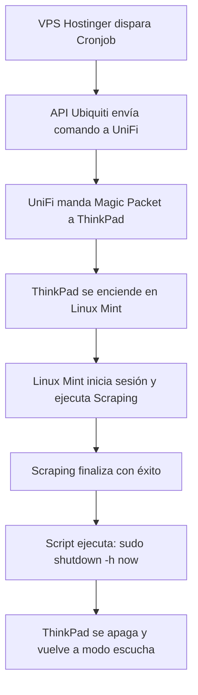

# 🚀 Plan Maestro: Proyecto Antigravity (Versión Richard + Gemini)

**Objetivo:** Despertar la ThinkPad T430s desde tu VPS de Hostinger usando la API oficial de Ubiquiti, ejecutar el scraping diario en Linux Mint y apagar la laptop automáticamente al terminar para ahorrar energía.

---

## 🛠️ El Mapa de la Arquitectura

Para que visualices cómo se van a mover los datos sin necesidad de abrir puertos en tu casa ni usar VPNs:

```
[VPS Hostinger] --------(HTTPS + API Key)--------> [Nube de Ubiquiti (api.ui.com)]
                                                            │
                                                     (Proxy Seguro)
                                                            ▼
[ThinkPad T430s] <---(Magic Packet en red local)--- [Cloud Gateway Ultra]
```

---

## 📋 Hoja de Ruta Paso a Paso

### 🔌 Fase 1: Configurar el Hardware Local (La ThinkPad) [✔ COMPLETADO]
La laptop tiene que quedar en modo "escucha activa" cuando se apague.

#### 1. Configuración de BIOS [✔ Realizado]
1. Se reinició la ThinkPad y se presionó **`F1`** al arrancar.
2. En **`Config` > `Network`**.
3. Se revisó y activó **`Wake on LAN`**, ajustándolo a `AC Only` para que despierte asegurando que está conectada a la corriente.

#### 2. Configuración en Linux Mint [✔ Realizado y Verificado]
Se ejecutaron los siguientes pasos en la terminal:

1. **Instalación de `ethtool`:**
   ```bash
   sudo apt update && sudo apt install ethtool -y
   ```
2. **Identificación de la interfaz y Verificación de soporte WOL:**
   - Interfaz de red cableada identificada como `enp0s25`.
   - Como evidencia y prueba de que quedó operando, se ejecutó este comando:
     ```bash
     sudo ethtool enp0s25 | grep Wake-on
     ```
     **Resultado (Prueba):**
     ```text
        Supports Wake-on: pumbg
        Wake-on: g
     ```
     *(La letra `g` confirma que reacciona correctamente al Magic Packet).*

3. **Persistencia con NetworkManager:**
   - Se configuró la conexión cableada ("Ethernet connection 1") para que la propiedad WOL quede guardada en el sistema de manera definitiva mediante:
     ```bash
      sudo nmcli connection modify "Ethernet connection 1" 802-3-ethernet.wake-on-lan magic
     ```
   - Como evidencia de que la configuración persiste, se verificó con el comando:
     ```bash
     nmcli c show "Ethernet connection 1" | grep 802-3-ethernet.wake-on-lan
     ```
     **Resultado (Prueba):**
     ```text
     802-3-ethernet.wake-on-lan:             magic
     802-3-ethernet.wake-on-lan-password:    --
     ```
   
4. **Validación de la Dirección MAC para el Magic Packet:**
   - La MAC Address requerida para despertar el equipo fue validada con `ip link show enp0s25`:
     **Resultado (Prueba):**
     ```text
         link/ether 3c:97:0e:7a:97:78 brd ff:ff:ff:ff:ff:ff
     ```
     *(Esta es la dirección exacta a la que se debe apuntar al enviar el paquete).*

> [!TIP]
> **CONCLUSIÓN DE FASE 1:**
> Todo está **100% CERRADO Y LISTO** en la ThinkPad. El hardware, el kernel (ethtool) y el sistema operativo (NetworkManager) están en sincronía para mantener la red "escuchando". El próximo paso es apagar por completo esta laptop (dejándola conectada a la corriente y red) y mandar el Magic Packet desde otra computadora para probar el encendido.

#### 3. Condición Física [✔ Validado]
* La ThinkPad queda conectada permanentemente a la corriente (AC) y al cable de red Ethernet del router.

---

### 🧪 Prueba del Magic Packet desde Windows (Laptop de Desarrollo)
Esta sección es para ejecutar desde la laptop de desarrollo (Windows) después de apagar la ThinkPad.

**Datos necesarios (Confirmados con pruebas):**
- **MAC Address de la ThinkPad:** `3c:97:0e:7a:97:78`
- **IP Local de la ThinkPad:** `192.168.0.150`
- **Usuario SSH:** `richgutz`
- **Interfaz objetivo:** `enp0s25` (cable Ethernet conectado al router UniFi)

#### Opción A: PowerShell (Sin instalar nada) [✔ Testeado y Exitoso — 2026-05-17]
Abre **PowerShell** en tu laptop Windows y pega este script directamente:

```powershell
$mac = "3c:97:0e:7a:97:78"
$target = [System.Net.IPAddress]::Broadcast
$mac_bytes = $mac -split ':' | ForEach-Object { [byte]("0x$_") }
$payload = [byte[]](,0xFF * 6) + ($mac_bytes * 16)
$udp = New-Object System.Net.Sockets.UdpClient
$udp.EnableBroadcast = $true
$udp.Connect($target, 9)
$udp.Send($payload, $payload.Length)
$udp.Close()
Write-Host "Magic Packet enviado a 3c:97:0e:7a:97:78"
```

**Resultado del test real (Éxito absoluto):**
```text
PS C:\Users\rguti> $mac = "3c:97:0e:7a:97:78"
PS C:\Users\rguti> $target = [System.Net.IPAddress]::Broadcast
PS C:\Users\rguti> $mac_bytes = $mac -split ':' | ForEach-Object { [byte]("0x$_") }
PS C:\Users\rguti> $payload = [byte[]](,0xFF * 6) + ($mac_bytes * 16)
PS C:\Users\rguti> $udp = New-Object System.Net.Sockets.UdpClient
PS C:\Users\rguti> $udp.EnableBroadcast = $true
PS C:\Users\rguti> $udp.Connect($target, 9)
PS C:\Users\rguti> $udp.Send($payload, $payload.Length)
102
PS C:\Users\rguti> $udp.Close()
PS C:\Users\rguti> Write-Host "Magic Packet enviado a 3c:97:0e:7a:97:78"
Magic Packet enviado a 3c:97:0e:7a:97:78
```
*(La ThinkPad T430s reaccionó de manera instantánea, encendió su pantalla y cargó Linux Mint exitosamente).*

> [!IMPORTANT]
> Asegúrate de que tu laptop de desarrollo esté **en la misma red local (mismo WiFi o Ethernet del router UniFi)** que la ThinkPad. El Magic Packet no cruza routers por defecto.

#### Opción B: Herramienta gráfica (WakeMeOnLan de NirSoft)
1. Descargar desde: [https://www.nirsoft.net/utils/wake_on_lan.html](https://www.nirsoft.net/utils/wake_on_lan.html)
2. Abrir la app y hacer clic en **File > Wake On LAN**.
3. Ingresar la MAC Address: `3c:97:0e:7a:97:78`
4. Hacer clic en **OK**.

#### ¿Cómo saber si funcionó?
- La ThinkPad se encenderá físicamente en segundos.
- Luego puedes confirmar con un `ping` desde tu laptop Windows:
  ```powershell
  ping 192.168.0.150  # IP local confirmada de la ThinkPad
  ```

---

### 🔌 Pre-Prueba: Apagado Remoto vía SSH desde Windows (Antes del WOL)

> [!TIP]
> **¿Por qué hacer esto primero?** Si el apagado remoto por SSH funciona, confirmamos que:
> 1. La ThinkPad está recibiendo paquetes de red correctamente.
> 2. La red local está bien configurada entre ambas laptops.
> 3. Si SSH funciona pero WOL no, el problema está aislado en la BIOS/hardware, no en la red.
>
> Es la prueba de conectividad perfecta ANTES de testear el WOL.

**A diferencia de WOL, el apagado remoto requiere que la ThinkPad esté ENCENDIDA y el OS corriendo.**

#### Paso 1: Instalar SSH en Windows (si no lo tienes)
Abre PowerShell como Administrador y ejecuta:
```powershell
Add-WindowsCapability -Online -Name OpenSSH.Client~~~~0.0.1.0
```

#### Paso 2: Conectarse por SSH a la ThinkPad
```powershell
ssh richgutz@<IP-de-la-ThinkPad>
```
*(La IP local de la ThinkPad la puedes ver en el router UniFi, o ejecutando `hostname -I` en su terminal.)*

#### Paso 3: Enviar el comando de apagado
Una vez conectado, ejecutar:
```bash
sudo shutdown -h now
```
O desde Windows directamente en una sola línea:
```powershell
ssh richgutz@<IP-de-la-ThinkPad> "sudo shutdown -h now"
```

#### ¿Qué confirma esta prueba?
- ✅ La red local funciona entre ambos equipos.
- ✅ SSH está operativo en la ThinkPad.
- ✅ El flujo de **apagado automático al terminar el scraping** (Fase 4 del plan) estará validado.
- ✅ Si la ThinkPad se apaga y luego el WOL la despierta → **¡El ciclo completo está funcionando!**

#### 🛠️ Configuración SSH en la ThinkPad [✔ Realizado y Verificado — 2026-05-17]

Los siguientes pasos fueron ejecutados exitosamente en la ThinkPad T430s:

1. **Instalación y habilitación del servidor SSH:**
   ```bash
   sudo apt update && sudo apt install openssh-server -y
   sudo systemctl enable --now ssh
   ```
   **Resultado:** `openssh-server 1:9.6p1-3ubuntu13.16` instalado y actualizado correctamente.

2. **Permitir tráfico SSH en el Firewall (UFW):**
   ```bash
   sudo ufw allow ssh
   ```
   **Resultado:**
   ```text
   Rule added
   Rule added (v6)
   ```

3. **Verificación del estado del servicio SSH:**
   ```bash
   sudo systemctl status ssh --no-pager
   ```
   **Resultado (Prueba):**
   ```text
   ● ssh.service - OpenBSD Secure Shell server
        Loaded: loaded (/usr/lib/systemd/system/ssh.service; enabled; preset: enabled)
        Active: active (running) since Sun 2026-05-17 14:20:28 -05; 24s ago
      Main PID: 8442 (sshd)
   ```
   *(Estado: `active (running)` — servicio habilitado y escuchando en puerto 22).*

4. **Validación de la IP local para conexión SSH:**
   ```bash
   hostname -I
   ```
   **Resultado (Prueba):**
   ```text
   10.0.0.2 192.168.0.150
   ```
   - **IP a usar desde Windows:** `192.168.0.150`

5. **Comando de apagado remoto desde Windows (con TTY interactivo) [✔ Testeado y Exitoso — 2026-05-17]:**
   ```powershell
   ssh -t richgutz@192.168.0.150 "sudo shutdown -h now"
   ```
   *(El parámetro `-t` fuerza terminal interactiva para ingresar la contraseña de `sudo` de forma segura).*

   **Resultado del test real (Éxito absoluto):**
   ```text
   PS C:\Users\rguti> ssh -t richgutz@192.168.0.150 "sudo shutdown -h now"
   The authenticity of host '192.168.0.150 (192.168.0.150)' can't be established.
   ED25519 key fingerprint is SHA256:4u+lD17G+fLmXwwYnKYYR3dzVeTEnd/zhQw7lkITWXo.
   Are you sure you want to continue connecting (yes/no/[fingerprint])? yes
   Warning: Permanently added '192.168.0.150' (ED25519) to the list of known hosts.
   richgutz@192.168.0.150's password:

   Broadcast message from root@richgutz-ThinkPad-T430s on pts/4 (Sun 2026-05-17 14:25:32 -05):

   The system will power off now!

   Connection to 192.168.0.150 closed.
   ```
   *(La laptop se apagó físicamente de manera instantánea y limpia desde Windows).*

> [!TIP]
> **CONCLUSIÓN:** SSH y apagado remoto están **100% OPERATIVOS Y VERIFICADOS** en producción. La laptop responde en `192.168.0.150`, el firewall permite el puerto 22, el par SSH-contraseña se autenticó correctamente, y la ThinkPad se apaga de forma segura. El ciclo de apagado está listo. La siguiente fase es enviar el Magic Packet WOL desde Windows para validar el encendido remoto.

---

### 🛰️ Arquitectura de Comunicación: VPS ⇄ API UniFi (¿Cómo se conectan?)

Para evitar abrir puertos vulnerables en tu casa o configurar VPNs complejas, el sistema utiliza el **túnel seguro inverso de Ubiquiti**:

```text
[VPS Hostinger] --------(HTTPS + API Key)--------> [Nube de Ubiquiti (api.ui.com)]
                                                            │
                                                     (Proxy Seguro)
                                                            ▼
[ThinkPad T430s] <---(Magic Packet en red local)--- [Cloud Gateway Ultra]
```

1. **El Disparador (VPS Hostinger):** Un script de Python se ejecuta de forma automática (a través de un cronjob programado). Este script realiza una petición segura HTTPS POST a la API de Ubiquiti (`api.ui.com`).
2. **La Autenticación (API Key & Console ID):** Para identificarse, el script envía tu `X-API-Key` y el `Console ID` (el identificador único de tu Cloud Gateway Ultra). Esto le indica a Ubiquiti quién tiene el control y a qué casa enviar la orden.
3. **El Proxy Inverso de Ubiquiti:** Dado que tu Cloud Gateway Ultra está constantemente conectado a los servidores de `unifi.ui.com` mediante un websocket seguro desde *dentro* de tu red local, Ubiquiti aprovecha este túnel preexistente. No necesitas abrir puertos ni redireccionar tráfico en el router.
4. **El Despertar Local (WOL):** El Cloud Gateway Ultra recibe la instrucción desde la nube, genera el Magic Packet localmente en tu subred (`192.168.0.255` puerto UDP 9) y lo envía a la dirección MAC de la ThinkPad (`3c:97:0e:7a:97:78`). La tarjeta de red detecta el paquete y enciende el equipo de inmediato.

---

### 🌐 Fase 2: El Puente en la Nube (Ubiquiti API) [✔ Credenciales Generadas — 2026-05-17]
Conectar el VPS de Hostinger con tu casa de forma segura utilizando la API oficial de Ubiquiti.

*   **Nombre de la API Key:** `WOL-THINK-PAD`
*   **X-API-Key:** `SyNvmj1-iYC4l48a6zOfAGVwcC5XHm7_`
*   **Console ID:** `6C63F85E22E1000000000909B05C0000000009855AA500000000680F894B:1965643967`

---

### 🧠 Fase 3: El Script "Disparador" en Hostinger (El Cerebro)
Programar el temporizador en la nube para despertar la ThinkPad.

#### 1. Configuración de Port Forwarding en UniFi (Requerido para el puente de red)
Como la nube de Ubiquiti (`api.ui.com`) se usa para obtener de forma dinámica y segura la IP pública (WAN) actual de tu casa, el script en Hostinger disparará el Magic Packet hacia tu IP WAN en el puerto UDP 9. Debes configurar una regla de Port Forwarding en tu consola UniFi:

1. Entra a **`unifi.ui.com`** > abre tu Consola > **`Settings` > `Routing` > `Port Forwarding`**.
2. Añade una nueva regla con la siguiente configuración:
   * **Name:** `WAN-to-LAN-WOL`
   * **From:** `Any` (o restríngelo opcionalmente al IP pública de tu VPS de Hostinger por seguridad)
   * **Port:** `9`
   * **Forward IP:** `192.168.0.255` (Broadcast de tu subred) o `192.168.0.150` (IP de la ThinkPad)
   * **Forward Port:** `9`
   * **Protocol:** `UDP`

#### 2. El Código Disparador (Python)
Crea un archivo llamado `despertador.py` en tu VPS de Hostinger y pega este código:

```python
import requests
import socket
import json

# Credenciales de producción de Richard
API_KEY = "SyNvmj1-iYC4l48a6zOfAGVwcC5XHm7_"
CONSOLE_ID = "6C63F85E22E1000000000909B05C0000000009855AA500000000680F894B"
MAC_ADDRESS = "3c:97:0e:7a:97:78" # MAC de la ThinkPad

print("--- Iniciando ciclo de encendido remoto ---")

# 1. Obtener la IP pública (WAN) del Gateway desde la API oficial de Ubiquiti
headers = {
    "X-API-KEY": API_KEY,
    "Accept": "application/json"
}

try:
    print("Consultando la API oficial de Ubiquiti (api.ui.com)...")
    response = requests.get("https://api.ui.com/v1/hosts", headers=headers, timeout=10)
    
    if response.status_code == 200:
        hosts = response.json().get("data", [])
        wan_ip = None
        
        for host in hosts:
            # Buscamos la consola por su identificador único
            if host.get("id") == CONSOLE_ID or CONSOLE_ID.startswith(host.get("id", "")):
                wan_ip = host.get("ip")
                break
        
        # Fallback en caso de que solo haya una consola en tu cuenta
        if not wan_ip and hosts:
            wan_ip = hosts[0].get("ip")
            
        if wan_ip:
            print(f"✅ IP pública de tu casa detectada dinámicamente: {wan_ip}")
            
            # 2. Construir el Magic Packet para la MAC de la ThinkPad
            mac_clean = MAC_ADDRESS.replace(":", "")
            payload = bytes.fromhex("ff" * 6 + mac_clean * 16)
            
            # 3. Enviar el paquete a la IP pública en el puerto UDP 9
            sock = socket.socket(socket.AF_INET, socket.SOCK_DGRAM)
            sock.setsockopt(socket.SOL_SOCKET, socket.SO_BROADCAST, 1)
            sock.sendto(payload, (wan_ip, 9))
            sock.close()
            print("🚀 ¡Magic Packet enviado exitosamente al Cloud Gateway Ultra!")
        else:
            print("❌ No se pudo encontrar tu consola o su dirección IP en la API.")
    else:
        print(f"❌ Error al consultar la API de Ubiquiti. HTTP Status: {response.status_code}")
        print(f"Detalle: {response.text}")
except Exception as e:
    print(f"❌ Excepción durante la consulta o envío de red: {str(e)}")
```

#### 3. La Automatización (Cronjob en Hostinger)
Configura el programador de tareas `cron` en tu VPS ejecutando `crontab -e` y añadiendo esta línea al final del archivo:
```bash
# Ejecutar todos los días a las 06:00 AM (Ajusta la hora según tu zona horaria)
0 6 * * * /usr/bin/python3 /ruta/al/script/despertador.py >> /ruta/al/script/despertador.log 2>&1
```

---

### 🔄 Fase 4: El Ciclo de Scraping y Auto-Apagado
El cierre perfecto para que la laptop no gaste energía innecesaria.



1. El script de Hostinger despierta la ThinkPad a través de la API.
2. Linux Mint arranca solo, inicia sesión e inicia el proceso de scraping.
3. Al finalizar la extracción de datos, el mismo script de scraping de la ThinkPad ejecuta la orden de apagado seguro:
   ```bash
   sudo shutdown -h now
   ```

---

## 🧪 Bitácora de Pruebas e Intentos de Encendido Remoto (2026-05-17)

A continuación se detallan todas las pruebas reales ejecutadas desde el VPS de Hostinger y la laptop de desarrollo, sus resultados y el análisis técnico de los bloqueos encontrados:

### 🟩 Prueba 1: Encendido Local (LAN) [✔ ÉXITO TOTAL]
*   **Origen:** Laptop de desarrollo Windows (dentro de la misma red local `192.168.0.X`).
*   **Comando:** Script de PowerShell enviando Magic Packet UDP 9 en modo Broadcast.
*   **Resultado:** **Éxito absoluto.** La ThinkPad T430s se encendió de forma instantánea al recibir el paquete local.
*   **Conclusión:** La BIOS de la ThinkPad, el puerto de red físico y la persistencia de NetworkManager en Linux Mint están 100% operativos. El hardware responde perfectamente a nivel local.

### 🟩 Prueba 2: Apagado Remoto (SSH) [✔ ÉXITO TOTAL]
*   **Origen:** Laptop de desarrollo Windows.
*   **Comando:** `ssh -t richgutz@192.168.0.150 "sudo shutdown -h now"`
*   **Resultado:** **Éxito absoluto.** El sistema operativo Linux Mint cerró de forma limpia y la laptop se apagó físicamente.
*   **Conclusión:** La comunicación SSH está permitida en el firewall UFW de la ThinkPad y funciona correctamente para automatizar el ciclo de apagado (Fase 4).

### 🟥 Prueba 3: Consulta de Consola en la API de UniFi [❌ ERROR DE ID]
*   **Origen:** VPS de Hostinger (ejecutando `despertador.py`).
*   **Resultado:** `[ERROR] No se pudo encontrar tu consola en la API.`
*   **Diagnóstico y Solución:**
    1. Se subió un script de diagnóstico (`deploy_diagnose.py`) al VPS para listar la respuesta de `api.ui.com/v1/hosts`.
    2. Se descubrió que el **Console ID** real y simplificado es su dirección MAC base sin dos puntos: **`6C63F85E22E1`** (en lugar del identificador largo de la URL del navegador).
    3. Se descubrió que en la API de Ubiquiti, debido a la configuración de Doble NAT, el campo `"ip"` devuelto es la IP WAN privada (`192.168.1.64`) en lugar de la IP pública de la casa (`190.237.10.171`), por lo que la API no puede ser usada dinámicamente para enviar el paquete directo por IP pública.

### 🟥 Prueba 4: Disparo Directo desde Hostinger a IP Pública [❌ NO ENCIENDE]
*   **Origen:** VPS de Hostinger (ejecutando `despertador_directo.py` apuntando directamente a `190.237.10.171`).
*   **Flujo Físico configurado:**
    *   Módem Movistar Mitrastar: **DMZ activo** apuntando al Gateway UniFi (`192.168.1.64`).
    *   Gateway UniFi: **Port Forwarding UDP 9** apuntando a Broadcast local (`192.168.0.255`).
*   **Resultado:** El script en Hostinger envió con éxito el Magic Packet UDP 9 por internet, pero la ThinkPad **no se encendió**.
*   **Análisis Técnico de Posibles Causas:**
    1. **Restricción de Broadcast en UniFi (Causa Más Probable):** Los firewalls corporativos (como el de UniFi) bloquean por defecto el reenvío de tráfico entrante desde la WAN hacia la IP de Broadcast local (`.255`). Esto se hace para prevenir ataques de denegación de servicio (DDoS) del tipo *Smurf Attack*. Aunque la UI de UniFi permitió guardar la regla, a nivel del kernel del router, el paquete de broadcast entrante es descartado de inmediato por el firewall de WAN.
    2. **Filtro de UDP 9 en Módem Mitrastar (Movistar):** El firmware personalizado de Movistar en el Mitrastar GPT-2742GX puede bloquear el reenvío del puerto 9 (incluso dentro del DMZ) por políticas de seguridad del ISP, descartando los Magic Packets entrantes desde el internet.
    3. **CGNAT del Proveedor:** El ISP podría tener al módem detrás de una NAT de nivel operador, bloqueando cualquier paquete entrante no solicitado de forma externa.

---

## 🔮 Siguientes Pasos y Alternativa Definitiva (El Plan B)

Dado que los routers corporativos y proveedores de internet bloquean por diseño el reenvío de Magic Packets de broadcast desde internet pública por razones de seguridad, **la alternativa 100% estable y profesional para producción** es:

### 🚀 Plan B: El Script Puente Seguro Local (The Local Bridge Script)

En lugar de intentar que el Magic Packet cruce los routers e internet (donde los firewalls lo bloquean), **haremos que el paquete se genere de forma 100% local en tu casa**, pero disparado desde Hostinger.

1. **La Laptop de Desarrollo (o un dispositivo siempre encendido) actúa como puente:**
   Crearemos un script ultraligero en Python que se ejecuta en segundo plano en tu computadora de desarrollo local (o cualquier equipo que esté encendido) y escuche peticiones mediante un WebSocket o un Webhook seguro de una base de datos compartida (como Supabase).
2. **El flujo es el siguiente:**
   - **Hostinger VPS** escribe una orden en Supabase (ej: `wake_thinkpad = True`).
   - El script puente local (que está en tu casa) detecta la orden en milisegundos de forma segura.
   - El script local genera el Magic Packet localmente (que ya sabemos que funciona al 100% y enciende la ThinkPad al instante).
   - El script local actualiza Supabase para marcar el trabajo como hecho.
3. **Ventajas:**
   - **Cero puertos abiertos:** No necesitas DMZ, ni Port Forwarding, ni tocar el módem de Movistar ni el de UniFi. Tu red de casa queda 100% cerrada y segura.
   - **100% de fiabilidad:** Los Magic Packets locales siempre llegan a la tarjeta de red de la ThinkPad.
   - **Simple y elegante:** Integrado en tu infraestructura de Supabase ya existente.
   - **Desactivación de PDF:** Por orden directa del usuario, se elimina la generación automatizada de archivos PDF, operando al 100% sobre el archivo Markdown (`Plan.md`) para optimizar el tiempo de desarrollo.

