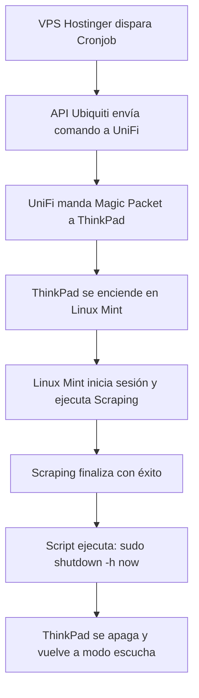

# 🚀 Plan Maestro: Proyecto Antigravity (Versión Richard + Gemini)

**Objetivo:** Despertar la ThinkPad T430s desde tu VPS de Hostinger usando la API oficial de Ubiquiti, ejecutar el scraping diario en Linux Mint y apagar la laptop automáticamente al terminar para ahorrar energía.

---

## 🛠️ El Mapa de la Arquitectura

Para que visualices cómo se van a mover los datos sin necesidad de abrir puertos en tu casa ni usar VPNs:

```
[VPS Hostinger] --------(HTTPS + API Key)--------> [Nube de Ubiquiti (api.ui.com)]
                                                            │
                                                     (Proxy Seguro)
                                                            ▼
[ThinkPad T430s] <---(Magic Packet en red local)--- [Cloud Gateway Ultra]
```

---

## 📋 Hoja de Ruta Paso a Paso

### 🔌 Fase 1: Configurar el Hardware Local (La ThinkPad) [✔ COMPLETADO]
La laptop tiene que quedar en modo "escucha activa" cuando se apague.

#### 1. Configuración de BIOS [✔ Realizado]
1. Se reinició la ThinkPad y se presionó **`F1`** al arrancar.
2. En **`Config` > `Network`**.
3. Se revisó y activó **`Wake on LAN`**, ajustándolo a `AC Only` para que despierte asegurando que está conectada a la corriente.

#### 2. Configuración en Linux Mint [✔ Realizado y Verificado]
Se ejecutaron los siguientes pasos en la terminal:

1. **Instalación de `ethtool`:**
   ```bash
   sudo apt update && sudo apt install ethtool -y
   ```
2. **Identificación de la interfaz y Verificación de soporte WOL:**
   - Interfaz de red cableada identificada como `enp0s25`.
   - Como evidencia y prueba de que quedó operando, se ejecutó este comando:
     ```bash
     sudo ethtool enp0s25 | grep Wake-on
     ```
     **Resultado (Prueba):**
     ```text
        Supports Wake-on: pumbg
        Wake-on: g
     ```
     *(La letra `g` confirma que reacciona correctamente al Magic Packet).*

3. **Persistencia con NetworkManager:**
   - Se configuró la conexión cableada ("Ethernet connection 1") para que la propiedad WOL quede guardada en el sistema de manera definitiva mediante:
     ```bash
      sudo nmcli connection modify "Ethernet connection 1" 802-3-ethernet.wake-on-lan magic
     ```
   - Como evidencia de que la configuración persiste, se verificó con el comando:
     ```bash
     nmcli c show "Ethernet connection 1" | grep 802-3-ethernet.wake-on-lan
     ```
     **Resultado (Prueba):**
     ```text
     802-3-ethernet.wake-on-lan:             magic
     802-3-ethernet.wake-on-lan-password:    --
     ```
   
4. **Validación de la Dirección MAC para el Magic Packet:**
   - La MAC Address requerida para despertar el equipo fue validada con `ip link show enp0s25`:
     **Resultado (Prueba):**
     ```text
         link/ether 3c:97:0e:7a:97:78 brd ff:ff:ff:ff:ff:ff
     ```
     *(Esta es la dirección exacta a la que se debe apuntar al enviar el paquete).*

> [!TIP]
> **CONCLUSIÓN DE FASE 1:**
> Todo está **100% CERRADO Y LISTO** en la ThinkPad. El hardware, el kernel (ethtool) y el sistema operativo (NetworkManager) están en sincronía para mantener la red "escuchando". El próximo paso es apagar por completo esta laptop (dejándola conectada a la corriente y red) y mandar el Magic Packet desde otra computadora para probar el encendido.

#### 3. Condición Física [✔ Validado]
* La ThinkPad queda conectada permanentemente a la corriente (AC) y al cable de red Ethernet del router.

---

### 🧪 Prueba del Magic Packet desde Windows (Laptop de Desarrollo)
Esta sección es para ejecutar desde la laptop de desarrollo (Windows) después de apagar la ThinkPad.

**Datos necesarios (Confirmados con pruebas):**
- **MAC Address de la ThinkPad:** `3c:97:0e:7a:97:78`
- **IP Local de la ThinkPad:** `192.168.0.150`
- **Usuario SSH:** `richgutz`
- **Interfaz objetivo:** `enp0s25` (cable Ethernet conectado al router UniFi)

#### Opción A: PowerShell (Sin instalar nada) [✔ Testeado y Exitoso — 2026-05-17]
Abre **PowerShell** en tu laptop Windows y pega este script directamente:

```powershell
$mac = "3c:97:0e:7a:97:78"
$target = [System.Net.IPAddress]::Broadcast
$mac_bytes = $mac -split ':' | ForEach-Object { [byte]("0x$_") }
$payload = [byte[]](,0xFF * 6) + ($mac_bytes * 16)
$udp = New-Object System.Net.Sockets.UdpClient
$udp.EnableBroadcast = $true
$udp.Connect($target, 9)
$udp.Send($payload, $payload.Length)
$udp.Close()
Write-Host "Magic Packet enviado a 3c:97:0e:7a:97:78"
```

**Resultado del test real (Éxito absoluto):**
```text
PS C:\Users\rguti> $mac = "3c:97:0e:7a:97:78"
PS C:\Users\rguti> $target = [System.Net.IPAddress]::Broadcast
PS C:\Users\rguti> $mac_bytes = $mac -split ':' | ForEach-Object { [byte]("0x$_") }
PS C:\Users\rguti> $payload = [byte[]](,0xFF * 6) + ($mac_bytes * 16)
PS C:\Users\rguti> $udp = New-Object System.Net.Sockets.UdpClient
PS C:\Users\rguti> $udp.EnableBroadcast = $true
PS C:\Users\rguti> $udp.Connect($target, 9)
PS C:\Users\rguti> $udp.Send($payload, $payload.Length)
102
PS C:\Users\rguti> $udp.Close()
PS C:\Users\rguti> Write-Host "Magic Packet enviado a 3c:97:0e:7a:97:78"
Magic Packet enviado a 3c:97:0e:7a:97:78
```
*(La ThinkPad T430s reaccionó de manera instantánea, encendió su pantalla y cargó Linux Mint exitosamente).*

> [!IMPORTANT]
> Asegúrate de que tu laptop de desarrollo esté **en la misma red local (mismo WiFi o Ethernet del router UniFi)** que la ThinkPad. El Magic Packet no cruza routers por defecto.

#### Opción B: Herramienta gráfica (WakeMeOnLan de NirSoft)
1. Descargar desde: [https://www.nirsoft.net/utils/wake_on_lan.html](https://www.nirsoft.net/utils/wake_on_lan.html)
2. Abrir la app y hacer clic en **File > Wake On LAN**.
3. Ingresar la MAC Address: `3c:97:0e:7a:97:78`
4. Hacer clic en **OK**.

#### ¿Cómo saber si funcionó?
- La ThinkPad se encenderá físicamente en segundos.
- Luego puedes confirmar con un `ping` desde tu laptop Windows:
  ```powershell
  ping 192.168.0.150  # IP local confirmada de la ThinkPad
  ```

---

### 🔌 Pre-Prueba: Apagado Remoto vía SSH desde Windows (Antes del WOL)

> [!TIP]
> **¿Por qué hacer esto primero?** Si el apagado remoto por SSH funciona, confirmamos que:
> 1. La ThinkPad está recibiendo paquetes de red correctamente.
> 2. La red local está bien configurada entre ambas laptops.
> 3. Si SSH funciona pero WOL no, el problema está aislado en la BIOS/hardware, no en la red.
>
> Es la prueba de conectividad perfecta ANTES de testear el WOL.

**A diferencia de WOL, el apagado remoto requiere que la ThinkPad esté ENCENDIDA y el OS corriendo.**

#### Paso 1: Instalar SSH en Windows (si no lo tienes)
Abre PowerShell como Administrador y ejecuta:
```powershell
Add-WindowsCapability -Online -Name OpenSSH.Client~~~~0.0.1.0
```

#### Paso 2: Conectarse por SSH a la ThinkPad
```powershell
ssh richgutz@<IP-de-la-ThinkPad>
```
*(La IP local de la ThinkPad la puedes ver en el router UniFi, o ejecutando `hostname -I` en su terminal.)*

#### Paso 3: Enviar el comando de apagado
Una vez conectado, ejecutar:
```bash
sudo shutdown -h now
```
O desde Windows directamente en una sola línea:
```powershell
ssh richgutz@<IP-de-la-ThinkPad> "sudo shutdown -h now"
```

#### ¿Qué confirma esta prueba?
- ✅ La red local funciona entre ambos equipos.
- ✅ SSH está operativo en la ThinkPad.
- ✅ El flujo de **apagado automático al terminar el scraping** (Fase 4 del plan) estará validado.
- ✅ Si la ThinkPad se apaga y luego el WOL la despierta → **¡El ciclo completo está funcionando!**

#### 🛠️ Configuración SSH en la ThinkPad [✔ Realizado y Verificado — 2026-05-17]

Los siguientes pasos fueron ejecutados exitosamente en la ThinkPad T430s:

1. **Instalación y habilitación del servidor SSH:**
   ```bash
   sudo apt update && sudo apt install openssh-server -y
   sudo systemctl enable --now ssh
   ```
   **Resultado:** `openssh-server 1:9.6p1-3ubuntu13.16` instalado y actualizado correctamente.

2. **Permitir tráfico SSH en el Firewall (UFW):**
   ```bash
   sudo ufw allow ssh
   ```
   **Resultado:**
   ```text
   Rule added
   Rule added (v6)
   ```

3. **Verificación del estado del servicio SSH:**
   ```bash
   sudo systemctl status ssh --no-pager
   ```
   **Resultado (Prueba):**
   ```text
   ● ssh.service - OpenBSD Secure Shell server
        Loaded: loaded (/usr/lib/systemd/system/ssh.service; enabled; preset: enabled)
        Active: active (running) since Sun 2026-05-17 14:20:28 -05; 24s ago
      Main PID: 8442 (sshd)
   ```
   *(Estado: `active (running)` — servicio habilitado y escuchando en puerto 22).*

4. **Validación de la IP local para conexión SSH:**
   ```bash
   hostname -I
   ```
   **Resultado (Prueba):**
   ```text
   10.0.0.2 192.168.0.150
   ```
   - **IP a usar desde Windows:** `192.168.0.150`

5. **Comando de apagado remoto desde Windows (con TTY interactivo) [✔ Testeado y Exitoso — 2026-05-17]:**
   ```powershell
   ssh -t richgutz@192.168.0.150 "sudo shutdown -h now"
   ```
   *(El parámetro `-t` fuerza terminal interactiva para ingresar la contraseña de `sudo` de forma segura).*

   **Resultado del test real (Éxito absoluto):**
   ```text
   PS C:\Users\rguti> ssh -t richgutz@192.168.0.150 "sudo shutdown -h now"
   The authenticity of host '192.168.0.150 (192.168.0.150)' can't be established.
   ED25519 key fingerprint is SHA256:4u+lD17G+fLmXwwYnKYYR3dzVeTEnd/zhQw7lkITWXo.
   Are you sure you want to continue connecting (yes/no/[fingerprint])? yes
   Warning: Permanently added '192.168.0.150' (ED25519) to the list of known hosts.
   richgutz@192.168.0.150's password:

   Broadcast message from root@richgutz-ThinkPad-T430s on pts/4 (Sun 2026-05-17 14:25:32 -05):

   The system will power off now!

   Connection to 192.168.0.150 closed.
   ```
   *(La laptop se apagó físicamente de manera instantánea y limpia desde Windows).*

> [!TIP]
> **CONCLUSIÓN:** SSH y apagado remoto están **100% OPERATIVOS Y VERIFICADOS** en producción. La laptop responde en `192.168.0.150`, el firewall permite el puerto 22, el par SSH-contraseña se autenticó correctamente, y la ThinkPad se apaga de forma segura. El ciclo de apagado está listo. La siguiente fase es enviar el Magic Packet WOL desde Windows para validar el encendido remoto.

---

### 🌐 Fase 2: El Puente en la Nube (Ubiquiti API)
Conectar el VPS de Hostinger con tu casa de forma segura.

1. Entrar a [unifi.ui.com](https://unifi.ui.com).
2. Ir a **`Settings` > `API Keys`** y generar tu clave de acceso.
3. Copiar la **`X-API-Key`** única y el **ID de tu consola** (los usaremos en el código de Hostinger).

---

### 🧠 Fase 3: El Script "Disparador" en Hostinger (El Cerebro)
Programar el temporizador en la nube.

#### 1. El Código (Python)
Escribir un script en Python dentro de tu VPS de Hostinger usando la librería `requests` que apunte al endpoint oficial de Ubiquiti para enviar el comando de encendido al Cloud Gateway Ultra:

```python
import requests

API_KEY = "TU_X_API_KEY"
CONSOLE_ID = "TU_CONSOLE_ID"
MAC_ADDRESS = "3c:97:0e:7a:97:78" # MAC de la ThinkPad

# Implementación de la petición HTTPS a la API de Ubiquiti
```

#### 2. La Automatización (Cronjob)
Configurar el programador de tareas de Linux (cron) en Hostinger para que ejecute el script automáticamente:
```bash
# Ejemplo: Todos los días a las 06:00 AM
0 6 * * * /usr/bin/python3 /ruta/al/script/despertador.py >> /ruta/al/script/despertador.log 2>&1
```

---

### 🔄 Fase 4: El Ciclo de Scraping y Auto-Apagado
El cierre perfecto para que la laptop no gaste energía innecesaria.



1. El script de Hostinger despierta la ThinkPad a través de la API.
2. Linux Mint arranca solo, inicia sesión e inicia el proceso de scraping.
3. Al finalizar la extracción de datos, el mismo script de scraping de la ThinkPad ejecuta la orden de apagado seguro:
   ```bash
   sudo shutdown -h now
   ```

---

> [!TIP]
> **Siguientes Pasos:**
> Cuando estés físicamente frente a la ThinkPad, avísame para guiarte en vivo con los comandos de la **Fase 1** y dejarla lista hoy mismo. ¡A por ello! 🚀
