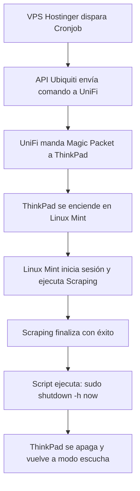

# 🚀 Plan Maestro: Proyecto Antigravity (Versión Richard + Gemini)

**Objetivo:** Despertar la ThinkPad T430s desde tu VPS de Hostinger usando la API oficial de Ubiquiti, ejecutar el scraping diario en Linux Mint y apagar la laptop automáticamente al terminar para ahorrar energía.

---

## 🛠️ El Mapa de la Arquitectura

Para que visualices cómo se van a mover los datos sin necesidad de abrir puertos en tu casa ni usar VPNs:

```
[VPS Hostinger] --------(HTTPS + API Key)--------> [Nube de Ubiquiti (api.ui.com)]
                                                            │
                                                     (Proxy Seguro)
                                                            ▼
[ThinkPad T430s] <---(Magic Packet en red local)--- [Cloud Gateway Ultra]
```

---

## 📋 Hoja de Ruta Paso a Paso

### 🔌 Fase 1: Configurar el Hardware Local (La ThinkPad) [✔ COMPLETADO]
La laptop tiene que quedar en modo "escucha activa" cuando se apague.

#### 1. Configuración de BIOS [✔ Realizado]
1. Se reinició la ThinkPad y se presionó **`F1`** al arrancar.
2. En **`Config` > `Network`**.
3. Se revisó y activó **`Wake on LAN`**, ajustándolo a `AC Only` para que despierte asegurando que está conectada a la corriente.

#### 2. Configuración en Linux Mint [✔ Realizado y Verificado]
Se ejecutaron los siguientes pasos en la terminal:

1. **Instalación de `ethtool`:**
   ```bash
   sudo apt update && sudo apt install ethtool -y
   ```
2. **Identificación de la interfaz y Verificación de soporte WOL:**
   - Interfaz de red cableada identificada como `enp0s25`.
   - Como evidencia y prueba de que quedó operando, se ejecutó este comando:
     ```bash
     sudo ethtool enp0s25 | grep Wake-on
     ```
     **Resultado (Prueba):**
     ```text
        Supports Wake-on: pumbg
        Wake-on: g
     ```
     *(La letra `g` confirma que reacciona correctamente al Magic Packet).*

3. **Persistencia con NetworkManager:**
   - Se configuró la conexión cableada ("Ethernet connection 1") para que la propiedad WOL quede guardada en el sistema de manera definitiva mediante:
     ```bash
      sudo nmcli connection modify "Ethernet connection 1" 802-3-ethernet.wake-on-lan magic
     ```
   - Como evidencia de que la configuración persiste, se verificó con el comando:
     ```bash
     nmcli c show "Ethernet connection 1" | grep 802-3-ethernet.wake-on-lan
     ```
     **Resultado (Prueba):**
     ```text
     802-3-ethernet.wake-on-lan:             magic
     802-3-ethernet.wake-on-lan-password:    --
     ```
   
4. **Validación de la Dirección MAC para el Magic Packet:**
   - La MAC Address requerida para despertar el equipo fue validada con `ip link show enp0s25`:
     **Resultado (Prueba):**
     ```text
         link/ether 3c:97:0e:7a:97:78 brd ff:ff:ff:ff:ff:ff
     ```
     *(Esta es la dirección exacta a la que se debe apuntar al enviar el paquete).*

#### 3. Condición Física [✔ Validado]
* La ThinkPad queda conectada permanentemente a la corriente (AC) y al cable de red Ethernet del router.

---

### 🧪 Pruebas Pendientes de Wake-on-LAN (Desde otro equipo)
Para que el **Gemini de la laptop de desarrollo** valide esto, el siguiente paso práctico (antes de programar la API de la nube) es hacer una prueba de envío local del Magic Packet:
1. Instalar un cliente WOL en la laptop de desarrollo (ej. `wakeonlan` en Linux o un cliente WOL en Windows).
2. Mandar el paquete usando la MAC Address de la ThinkPad (ej. `3c:97:0e:7a:97:78`).
3. Comprobar que la ThinkPad enciende desde apagado total.

---

### 🌐 Fase 2: El Puente en la Nube (Ubiquiti API)
Conectar el VPS de Hostinger con tu casa de forma segura.

1. Entrar a [unifi.ui.com](https://unifi.ui.com).
2. Ir a **`Settings` > `API Keys`** y generar tu clave de acceso.
3. Copiar la **`X-API-Key`** única y el **ID de tu consola** (los usaremos en el código de Hostinger).

---

### 🧠 Fase 3: El Script "Disparador" en Hostinger (El Cerebro)
Programar el temporizador en la nube.

#### 1. El Código (Python)
Escribir un script en Python dentro de tu VPS de Hostinger usando la librería `requests` que apunte al endpoint oficial de Ubiquiti para enviar el comando de encendido al Cloud Gateway Ultra:

```python
import requests

API_KEY = "TU_X_API_KEY"
CONSOLE_ID = "TU_CONSOLE_ID"
MAC_ADDRESS = "3c:97:0e:7a:97:78" # MAC de la ThinkPad

# Implementación de la petición HTTPS a la API de Ubiquiti
```

#### 2. La Automatización (Cronjob)
Configurar el programador de tareas de Linux (cron) en Hostinger para que ejecute el script automáticamente:
```bash
# Ejemplo: Todos los días a las 06:00 AM
0 6 * * * /usr/bin/python3 /ruta/al/script/despertador.py >> /ruta/al/script/despertador.log 2>&1
```

---

### 🔄 Fase 4: El Ciclo de Scraping y Auto-Apagado
El cierre perfecto para que la laptop no gaste energía innecesaria.



1. El script de Hostinger despierta la ThinkPad a través de la API.
2. Linux Mint arranca solo, inicia sesión e inicia el proceso de scraping.
3. Al finalizar la extracción de datos, el mismo script de scraping de la ThinkPad ejecuta la orden de apagado seguro:
   ```bash
   sudo shutdown -h now
   ```

---

> [!TIP]
> **Siguientes Pasos:**
> Cuando estés físicamente frente a la ThinkPad, avísame para guiarte en vivo con los comandos de la **Fase 1** y dejarla lista hoy mismo. ¡A por ello! 🚀
