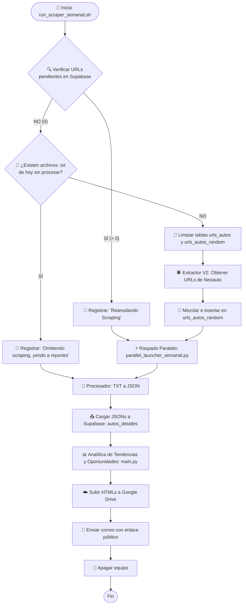

# Plan de Mejora y Robustez del Scraper Semanal

Este plan propone una re-estructuración y mejoras de resiliencia para el flujo del scraper semanal, el cual ha estado experimentando fallos recurrentes de interrupción, bloqueos silenciosos en el uploader de Google Drive y pérdida de progreso por reinicios accidentales.

## Estatus y Diagnóstico de Fallas Comunes

1. **Reinicio Accidental en Caliente (Cola Vacía):**
   * **Problema:** Si el scraper paralelo termina al 100% (dejando `urls_autos_random` con 0 pendientes), pero el script se detiene antes de terminar los reportes (por ejemplo, por apagado programado del script diario o corte de luz), al re-ejecutar el script semanal este lee `PENDING_COUNT = 0`. Por lo tanto, asume que es una ejecución nueva, borra la base de datos completa y reinicia la descarga de 2,600+ URLs desde cero, perdiendo todo el trabajo de scraping ya realizado.
2. **Cuelgues en Headless del Uploader de Google Drive:**
   * **Problema:** Si el token de OAuth (`token.json`) expira o es revocado, `drive_uploader.py` intenta abrir un navegador local (`flow.run_local_server`). En un entorno sin pantalla (VPS headless / Cron), este proceso se cuelga indefinidamente bloqueando el cierre del script y consumiendo CPU.
3. **Interferencia entre Diario y Semanal:**
   * **Problema:** El script diario inicia a las 06:32 PM de forma fija y apaga la máquina al terminar. Si el semanal es ejecutado por el usuario o se retrasa y coincide con la franja de las 06:30 - 07:30 PM, el apagado del diario matará al semanal de forma abrupta.

---

## Propuesta de Mejoras

### 1. Control de Estado Inteligente de 3 Fases en Bash
Modificaremos `run_scraper_semanal.sh` para verificar el estado real no solo en Supabase, sino también en el filesystem local.

* **Fase A (Extracción de URLs):** Solo se ejecuta si no hay archivos planos de la fecha actual en `results_txt/` y la cola está vacía.
* **Fase B (Scraping Paralelo):** Solo se ejecuta si existen URLs pendientes en `urls_autos_random`.
* **Fase C (Consolidación y Reportes):** Si ya hay archivos planos `.txt` generados hoy y la cola de URLs es 0, el script omitirá el raspado y saltará directamente a procesar texto, subir a Supabase y enviar el reporte.

### 2. Control de Cuelgues en Drive Uploader
* Añadir un control en `drive_uploader.py` para detectar si el script se ejecuta en modo interactivo. Si no hay una consola/navegador interactivo disponible y las credenciales expiran, el script debe fallar explícitamente (`sys.exit(1)`) y registrar el error en lugar de colgarse esperando por Oauth.

---

## Flujograma Detallado de la Secuencia Semanal

A continuación se detalla el flujo lógico óptimo propuesto para la secuencia semanal:

---

## Propuesta de Cambios en Código

### [run_scraper_semanal.sh](file:///home/richgutz/Scraper-Neoauto-ANTIGRAVITY/run_scraper_semanal.sh)
Reemplazar la lógica de comprobación de URLs del bloque inicial por una evaluación de archivos `.txt` en disco del día actual, de manera que no limpie la base de datos si el scraping ya ocurrió.

### [google_drive/drive_uploader.py](file:///home/richgutz/Scraper-Neoauto-ANTIGRAVITY/google_drive/drive_uploader.py)
Modificar `get_drive_service()` para desactivar el flujo de autenticación local si detecta un entorno no interactivo o si se está ejecutando desde cron (por ejemplo, analizando si `sys.stdin.isatty()` es falso).

---

## Plan de Verificación

### Pruebas Manuales
1. **Simulación de Reanudación de Reporte:**
   * Mover archivos procesados a la carpeta activa, poner la cola de Supabase en 0 y verificar que `./run_scraper_semanal.sh` no limpie tablas y procese directamente los archivos.
2. **Simulación de Expiración de Token:**
   * Renombrar temporalmente `token.json` y verificar que el cargador de Drive falle limpiamente con error en lugar de colgarse esperando Oauth en terminal.
